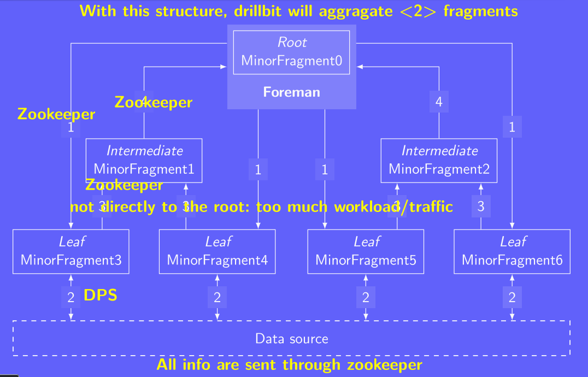

# VE472 Midterm Review

## Introduction to Hadoop

1.  **What is the major issue of computer when facing big data? CPU or Memory or Throughput?**

    Throughput (data transfer rate), Von Neumann bottleneck

2.  **Ways of increasing throughput:**

    -   Caching
    -   Branch prediction
    -   Parallel Read from multiple locations (RAID)

3.  **How big is Big data? Or consider how large the data should be so that using Hadoop would be more efficient?**

    \>1 TB. Generally petabytes in size. Hadoop clusters usually holds TB to PB of data and can process petabytes of data within minutes.

4.  **Why is database, high-performance computing and volunteer computing insufficient for big data?**

5.  **What is a container?**

    A container is an environment with restricted resources where application-specific processes are run.

6.  **History of Hadoop: when did it start? Which company developed Hadoop?**

    2002 as Apache Nutch. Apache Software Foundation.

7.  **Goal of Hadoop:**

    Efficiently analyse massive amount of data

8.  **Basic components of Hadoop:**

    -   common libraries
    -   HDFS
    -   MapReduce
    -   YARN

9.  **Why Java as programming language?**

    It is cross-platform.

10.  Some numbers:

     -   Total data by 2020: 44 billion TB
     -   Data that a CDROM can hold: 700 MB
     -   DVD can hold: 5GB
     -   BR: 25 GB
     -   A block inside RAM: 4 KB

11.  **Pros and Cons of HDFS?**

     - High throughput
     - Large latency; metadata kept in namenode's memory; write always in append mode by a single writer.

12.  **What is a container?**

     A container is an environment with restricted resources where application-specific processes are run

13.  **What is YARN?**

     Resource manager/scheduler.

     - Interacts with the filesystem
     - Hides low level details from the user
     - Offers an intermediate layer supporting many other distributed programming paradigms

14.  **Differences between Batch processing and real-time processing?**

     In batch processing, data is processed in parts. The data is first stored, and then processed. In real-time processing data is processed as soon as data is received, needs to be responsive and active.

     Examples: batch processing: Apache Hadoop (MapReduce)

     real-time: Apache Spark Streaming, Apache Storm, Apache Kafka, Redis

15.  **Three layers of Lambda Data Architecture:**

     -   Batch layer, storing data in batch
     -   Speed layer, analyse the data
     -   Serving layer, serve curated data

     data are provided to batch layer and speed layer simultaneously.

     Kappa Data Architecture: batch layer is removed.

16.  **Difference between Drill and Spark?**

     Drill: SQL query engine for Big Data exploration.
     - Drill allows fine grained security at the file level.
     - SQL queries, searching -> use drill

     Spark: fast and general-purpose cluster computing system.
     - Spark can also do SQL queries.
     - Complex algorithms, ML & AI -> use spark.

     

## Hadoop's Core Components

### HDFS

1.  **What is LVM?**

    Local Volume Manager: manage disk partition

2.  **Default block size of HDFS**

    128MB

3.  **Commands retrieving information of file**

    `lsattr`, `ls -l`...

4.  **Pros and cons of having large/small blocks?**

    Large block: good when dealing with large data, have low latency; bad since it may waste memory
    Small block: save memory for smaller files, but wastes memory keeping track of free blocks, time-consuming when fetching data

5.  **Jobs of namenode and datanode:**

    namenode is read only, maintains metadata of data in datanode
    datanode store only the data, reports the stored blocks to namenode

6.  **What to do if the namenode fails?**

    Use backup namenode, via Network FileSystem(NFS) or `rsync`.

7.  **When I have 2 namenodes, is it good or bad to have each namenode store half of the data nodes?**

    Bad because if one namenode fail, half of the datanodes are lost

8.  **Having two namenodes in Active-Passive mode, when may race condition happen, how to avoid race conditions?**

    Active node goes down -> use passive node to write -> active node comes back -> have two active nodes writing -> race conditions.
    STONITH: shoot the other node in the head
    If one namenode become active, kill the other node

9.  **Default replication level of HDFS**:

    3.

    -   First: same node as the client.
    -   Second: random, different rack from the first
    -   Third: same rack as the second but different node

10.  **Where should computation be done?**
     On rack holding second and third replication: data transfer on the same rack is fast.

11.  **How does Distributed filesystem contact NameNode?**
     Via RPC(Remote Procedure Call) Connection

12.  **How do you access the data in homework?**

     Through `sftp`.

### YARN

1.  **What is client node?**

    Client node is CPU (for calculation), in contrast data node is hard disk (for storage)

2.  **Jobs of resource manager and node manager in YARN.**

    RM: Manage the nodes, NM: Start container that runs applications

3.  **What is application master?**

    Application Master is a process that coordinates the execution of an application in the cluster. It is responsible for the execution of a single application. It asks for containers from the Resource Manager and executes specific programs (tasks) on the obtained containers. It is typically launched by Resource Manager and run in a container.

4.  **Why are node manager nodes connected through subthreads instead of connecting directly to resource manager node?**

    Minimize traffic, decrease bandwidth, make things faster

5.  **Preferred location of the containers?**

    We aim to minimize data transfer time

    Best: the same as the node where data is stored,
    ok: the computer on the same rack

6.  **Three ways YARN are used:**

    -   One application per user job
    -   One application per user session
    -   Long-running application shared among users

    No need to kill container for the last two case -> save time with previous data.

7.  **Three schedulers in YARN:**
    -   FIFO
    -   Capacity (DEFAULT scheduler, waste resources, containers not killed inside a queue)
    -   Fair (resource fairly shared, high latency due to allocation and deallocation of resources for different jobs)

8.  **How does YARN solve the problem that an application requesting a busy node?**

    Each nodes send out heartbeat reporting the running containers and available resources. Wait for some heartbeat before loosing the requirement.

### MapReduce

1.  **Three steps of MapReduce:**

    -   Map
    -   Shuffle
    -   Reduce

2.  **Pros and Cons of MapReduce reading from/writing to disk?**

    Safe but slow. In contrast Spark and Drill will minimize disk usage.

3.  **What to do when task fails, JVM crashes, or task hangs.**

4.  **Why are data compressed before sending to other reducers?**

    To reduce traffic. For the similar reason, only smaller part of data are sent to other reducers.

     

## Drill, Spark and more

### Drill

SQL for Big Data

1.  **Functions of Zookeeper:**

    Dependent of Drill. No large data-store, allow different nodes in cluster to communicate; let various applications of hadoop to work together.

2.  **What is a drillbit?**

    A drill process created when running Drill on YARN. Each query given to drill is split into fragments and they are run on different drillbits.

3.  **What is a foreman drillbit?**

    A drillbit that receives the query. Every drillbit can be foreman drillbit.

4.  **Characteristics of Drill:**

    -   Each drillbit contains all services and capabilities of Drill
    -   Columnar execution
    -   Optimistic query execution
    -   Vectorization
    -   Runtime Compilation

### Spark

1.  **Two modes of spark:**

    -   Client mode (Interaction with user)
    -   Cluster mode (Runs on cluster, fully utilize hadoop)

2.  **What is an RDD?**

    Resilient Distributed Dataset, a fundamental data structure of spark. It is a *read-only*, *partitioned* collection of records.

3.  **What does `resilient` mean in RDD?**

    It is able to be reconstructed in case of partition loss, since it is storing how it was derived from other datasets.

4.  **What does `distributed` mean in RDD?**

    RDD's elements can be partitioned across machines based on a key in each record..

5.  **What make RDDs fast?**

    -   Distributed collections of objects that can be *cached in memory* (drop using LRU) across cluster nodes
    -   Manipulated through various parallel operations
    -   Automatically rebuilt on failure.

6.  **Two types of operations on an RDD:**

    -   *Transformation*: creating new dataset, lazy evaluation (not executed until it sees an action, reorganize and optimize the process), avoid returning large datasets
    -   *Action*: Compute on a dataset

7.  **Caching levels of RDDs:**

    -   Memory only
    -   Memory and disk (RDD too long to reconstruct)
    -   Memory only serialized (use Snappy to compress)
    -   Replication (for security)

8.  **Difference between Spark and MapReduce?**

    Data storage: MapReduce use disk and play safe while Spark minimize disk usage, use memory as much as possible.

    Upon failure: MapReduce use replication data; Spark simply reconstruct RDD

    Speed: Spark is much faster

### More tools

1.  **What is Kubernetes?**

    A container orchestration tool, usually handles clusters that runs dockers

## Some Other Advice

1.  Get familiar with how YARN, MapReduce, Drill and Spark work by looking at the flow charts on the slides,
2.  Have a good review of your work in labs and homework: how clusters are set, how MapReduce is done, etc.